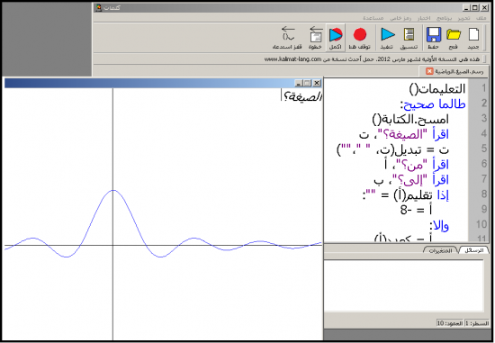
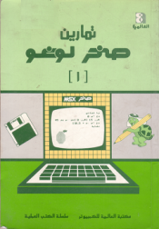
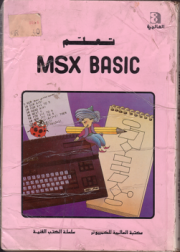
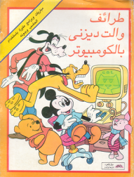
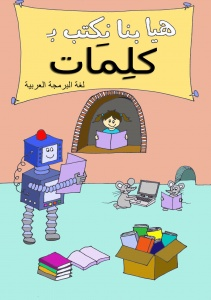
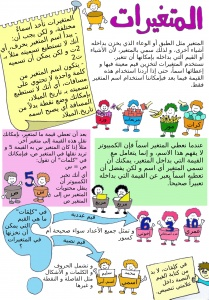

# لغة "كلمات"

> المطور والمبتكر هو محمد سامي، هذا ما نعرفه إلى الآن عنه، الاسم فقط

> الكلمات هنا مقتبس كثير منها من الموقع الرمي من ويب أركيف

> بدأ العمل على اللغة عام 2011  وتوقف عام 2013 وفقا لما [يظهره موقع ويب أركيف](http://web.archive.org/web/2013*/http://www.kalimat-lang.com/wiki/%D8%B9%D9%86_%D9%83%D9%84%D9%85%D8%A7%D8%AA)

<samp>
 "لغة <b>كلمات</b>, لغة برمجة عربية جديدة لتعليم الأطفال البرمجة. اللغة سهلة الاستخدام لكنها اقوى مما تبدو عليه!. اللغة مفتوحة المصدر ومتاحة بالمجان. اللغة جزء من خطة طويلة المدى للمساهمة في النهضة العلمية بالمجتمع."، هذا كان كلام محمد سامي من الصفحة الرسمية للغة، مع تصريف بسيط، وهنا سأحاول جمع كل ما يمكن عن اللغة ومصادر تعلمها والأمثلة والتطبيقات بها. 
</samp> 

---

# عن كلمات

> مقتبس من الموقع الرسمي: http://web.archive.org/web/20121226145141/http://www.kalimat-lang.com/wiki/%D8%B9%D9%86_%D9%83%D9%84%D9%85%D8%A7%D8%AA

## قديماً كانت البرمجة وسيلة للتعبير عن النفس

في طفولتي كان كثير من الأطفال يبرمجون على كمبيوتر صخر وسائر الأجهزة المنزلية (كومودور، تكساس، سنكلير...)، لم يكن احد منهم يعرف انه هناك وظيفة اسمها مبرمج، بل كانوا يفعلون ذلك ليكتبوا ألعاباً وبرامجاً ويعبروا عن انفسهم بالضبط كمن يرسم أو يؤلف القصص أو يكتب الشعر. الأكثر من ذلك أن البيئة نفسها كانت تساعدهم على ذلك: الكتب والمجلات ومحلات الكمبيوتر كانت كلها تكون بيئة تشجع أي طفل على البرمجة.

<table align=center>
  <tr>
    <td></td>
    <td></td>
    <td></td>
  </tr>
</table>

# ووسيلة للتعبير عن النفس للكبار أيضاً

حين كنت طالباً بكلية الحاسبات، كنت اكتب برامجاً رسومية صغيرة (مؤثرات، أشياء تتحرك) واضعها على كمبيوتر في السكشن ليراها الآخرون..مع الوقت صار هناك سباق بيني وبين الزملاء، كل شخص يأتي في المرة التالية ومعه برنامجاً أعقد ممن سبقه. كانت البرمجة هنا شيئاً يتنافس الناس عليه. شيء "روش" إن صح التعبير. وحين يشعر الشاب بأن الشيء روش، فلن تحتاج أن تضغط عليه لكي يتعلمه.

# لكن الأمور قد تغيرت

الاطفال والكبار الآن مستخدمون للتكنولوجيا لا صانعون لها. حتى المبرمجين، لم يعد عملهم يتعدى تركيب المكونات على بعضها. أين الاستمتاع بالبرمجة؟ أين الإبداع؟ لماذا نقضي الشهور في حوارات على غرار "الجافا افضل أم الدوت نت" أو "لينكس أفضل أم الويندوز"؟ لماذا نتجادل في انتاج الآخرين بدلاً من أن نتكلم عن برامجنا نحن؟

يقول أحد المبرمجين الأمريكان: حين يختفي الإبداع يتخذ الناس الذوق بديلاً عن المهارة. أي أنه إن كنت انا غير مبدع وانت غير مبدع فكيف انافسك؟ بدلا من ان اقول "انظر لقدرات برنامجي" سأقول "انا اخترت لغة افضل منك"!

لقد نسينا متعة البرمجة، وقد آن لنا أن نتذكرها.

# هيا نغير الأمور للأفضل

نريد إعادة روح الإبداع والتنافس للعالم البرمجي في الوطن العربي. من أجل هذا صنعنا لغة كلمات وهي سلاح نراه قوياً في هذا الأمر. لماذا؟

- لأنها سهلة الاستخدام وسهلة التعلم، مما يتيح لعدد أكبر بكثير ان يدخلوا مجال البرمجة، وأن يدخلوها في سن مبكر حيث الاهتمام بالاستمتاع والتعبير عن النفس وليس البرمجة لأسباب وظيفية.
- تتيح البرمجة باللغة العربية، مما يسمح لشريحة أوسع من المجتمع أن تدخل في هذا العالم، وتزيح عائقاً أمام كثير من الاطفال الاذكياء لكن لم يتعلموا الانجليزية.
- الإبداع بالرسوم والألعاب سهل في كلمات: لا تحتاج إلى تركيب مكتبة مثل SDL أو DirectX أو PyGame كي تبدأ: كل شيء موجود بالفعل كجزء من الأوامر الاساسية للغة.
- اللغة نفسها قوية وتنمو بنمو قدرات المبرمج، فيمكن استخدام اوامر صغيرة اولا لتكون لغة شبيهة بلغة البيسك القديمة، ثم الانتقال بعد ذلك للإجراءات، البرمجة الكائنية OOP، وحتى البرمجة المتوازية!
- بيئة التطوير الخاصة باللغة مصممة من أجل التعليم، ونفخر أن يكون بها إمكانات خصيصاً لذلك:

- 1. يمكنك أن تنسخ الكود بصيغة HTML مع ضبط المحاذاة وتلوين الكلمات، لتضع الكود بسهولة على مدونتك أو على منتدى تعليمي.
  2. يمكن كذلك نسخها بصيغة Wiki لكي يتعاون الناس على تصميم كتب لها عبر الإنترنت.
  3. بها إمكانية تتبع سير البرنامج أثناء تنفيذه (المراقب العجيب).
  4. بها debugger.
- ...وهناك إمكانات اخرى يخطط لها.

# لم ننس الجانب الاجتماعي أيضاً

نحن نؤمن أن نجاح لغة مثل كلمات مرتبط بالبيئة الاجتماعية التي تظهر فيها وليس فقط الجانب التكنولوجي. لذلك تحدثنا مع مراكز تدريبية (من التي تعلم الاطفال البرمجة) لمناقشة إمكانية إضافتها لمناهجهم، ونتحدث كذلك مع المدارس.

هناك أيضاً عمل يبذل الآن لإنتاج كتب تضاهي كتب البرمجة الرائعة التي كانت تقدم للأطفال في الثمانينات، ونسعى في المستقبل لوجود أكبر على الإنترنت بعمل موقع مشاركة مثلما تم في سكراتش بحيث يمكن للجميع مشاركة برامجهم واستعراضها. نتمنى أيضاً بشدة أن يكون الجانب الاجتماعي اكبر من مجهوداتنا فحسب، وأن يظهر بإذن الله مواقع ومنتديات عن البرمجة للأطفال ومنتديات تعليم البرمجة في المدارس،...الخ تكون مستقلة عنا وتتحرك للأمام في مساراتها الخاصة.

أخيراً نفكر بجدية في مسألة تطبيق لغات البرمجة العربية في مشاريع احترافية، ونتمنى على المدى الطويل رفع مستوى كلمات لإمكانات اقوى مع الحفاظ على اهدافها التعليمية أو - إن لم يتسن ذلك - تطوير لغة برمجة عربية احترافية موازية.

<table align=center>
  <tr>
    <td></td>
    <td></td>
  </tr>
</table>
